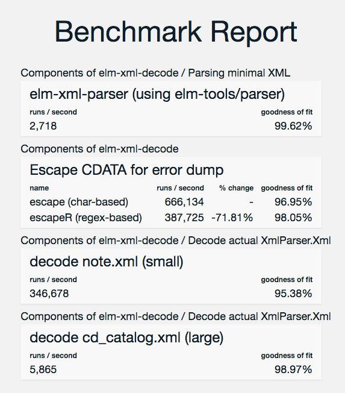

# elm-xml-decode

[![CircleCI][cc]](https://circleci.com/gh/ymtszw/elm-xml-decode/tree/master)

[cc]: https://circleci.com/gh/ymtszw/elm-xml-decode/tree/master.svg?style=svg

XML decoder, sharing the spirit of [`Json.Decode`][jd].

Using [jinjor/elm-xml-parser][exp] as its parser component.

[jd]: http://package.elm-lang.org/packages/elm-lang/core/latest/Json-Decode
[exp]: http://package.elm-lang.org/packages/jinjor/elm-xml-parser/latest

## Related Works

[eeue56/elm-xml][ex] is an existing full-package XML parser/decoder for Elm,
though I intend to provide an alternative XML decoder which exhibits following properties:

- Provides [`Decoder`][de]-based APIs, sharing the spirit of [`Json.Decode`][jd]
- Also provides DSL-styled decoder compositions, sharing the sprits of [`Json.Decode.Pipeline`][jdp]
- Handles list of XML node with identical tags, using [`ListDecoder`][ld] type
- Locates targeting XML nodes using "path" of tags, partially mimicking XPath

[ex]: http://package.elm-lang.org/packages/eeue56/elm-xml/latest
[de]: http://package.elm-lang.org/packages/ymtszw/elm-xml-decode/latest/Xml-Decode#Decoder
[jdp]: http://package.elm-lang.org/packages/NoRedInk/elm-decode-pipeline/latest/Json-Decode-Pipeline
[ld]: http://package.elm-lang.org/packages/ymtszw/elm-xml-decode/latest/Xml-Decode#ListDecoder


## Examples

Basics:

```elm
import Xml.Decode exposing (..)

type alias Example =
    { string : String
    , integers : List Int
    }

exampleDecoder : Decoder Example
exampleDecoder =
    map2 Example
        (path [ "path", "to", "string", "value" ] (single string))
        (path [ "path", "to", "int", "values" ] (list int))

run exampleDecoder
    """
    <root>
        <path>
            <to>
                <string>
                    <value>SomeString</value>
                </string>
                <int>
                    <values>1</values>
                    <values>2</values>
                </int>
            </to>
        </path>
    </root>
    """
--> Ok { string = "SomeString", integers = [ 1, 2 ] }
```

### Pipeline Decoder compositions

We have `map`, `map2` and variants, though the Pipeline style is also possible:

```elm
pipelineDecoder : Decoder Example
pipelineDecoder =
    succeed Example
        |> requiredPath [ "path", "to", "string", "value" ] (single string)
        |> requiredPath [ "path", "to", "int", "values" ] (list int)
```

## Development

Globally install Elm Platform, [`elm-test`](https://github.com/rtfeldman/node-test-runner),
and [`elm-verify-examples`](https://github.com/stoeffel/elm-verify-examples)

```sh
$ elm-test
$ elm-verify-examples
$ elm-verify-examples --elm-test=elm-test # Explicitly set elm-test to use, if particular elm-test version has some issues
```

## Benchmark: Are they efficient? Are they fast?

(**Not yet updated for Elm 0.19**)

Benchmark codes can be found in `benchmarks/` directory.

### In Elm 0.18 (elm-xml-decode 1.x)

Using [BrianHicks/elm-benchmark][eb] and [examples in W3School][w3s].
Available [here][bench] as a static web page.

[eb]: http://package.elm-lang.org/packages/BrianHicks/elm-benchmark/latest/Benchmark
[bench]: https://ymtszw.github.io/elm-xml-decode/
[w3s]: https://www.w3schools.com/xml/xml_examples.asp

Sample result (on my MacBookPro early 2015):

- CPU: Core i5 2.7GHz
- Mem: DDR3 8GB 1867MHz
- Google Chrome 63.0.3239.84 64bit



[jinjor/elm-xml-parser][exp] was using [elm-tools/parser][etp],
which suffered from some performance issues at that time (possibly related to [this comment][issue]?).

[etp]: http://package.elm-lang.org/packages/elm-tools/parser/latest
[issue]: https://github.com/elm-tools/parser/issues/15#issuecomment-336223879

Although decoding part should practically be fast enough (see decode result of note.xml and cd_catalog.xml).

Looking forward to see similar benchmarks from other related works!!

## License

BSD-3-Clause
